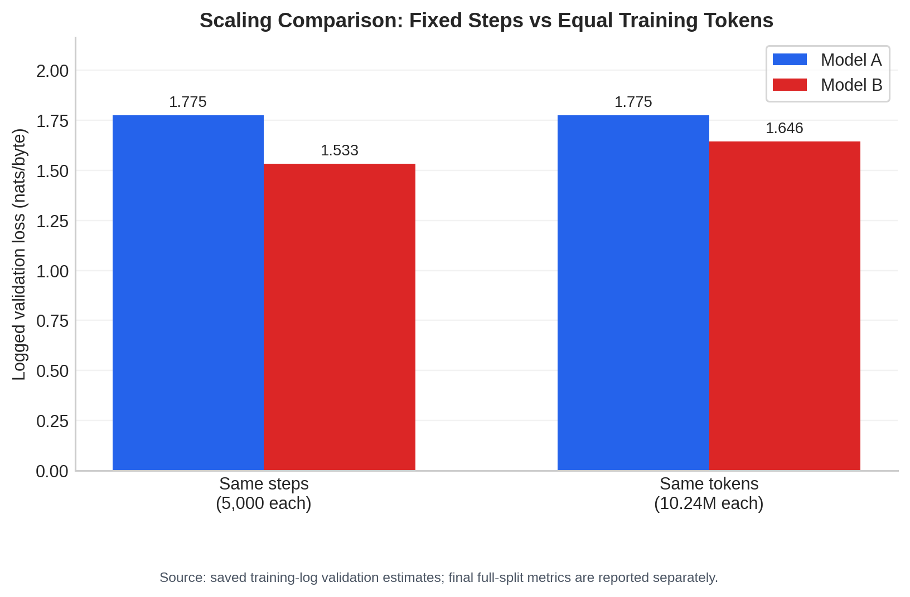

# Mini-LLM Tiny Shakespeare

A byte-level GPT-style Transformer implemented in PyTorch. The project trains and compares two configurations on the Tiny Shakespeare corpus:

* **Model A:** 2 layers, 4 heads, 128 embedding, context length 64
* **Model B:** 4 layers, 4 heads, 256 embedding, context length 128


## Results

Final checkpoints are evaluated deterministically over all next-byte targets in the validation split.

| Model | Training tokens | Validation loss | Perplexity | Bits/byte |
| ----- | --------------: | --------------: | ---------: | --------: |
| A     |          10.24M |          1.7431 |     5.7149 |    2.5147 |
| B     |          20.48M |          1.5059 |     4.5082 |    2.1726 |

At the largest exact shared training budget of **10.24M tokens**, Model B also performs better:

* Model A validation loss: **1.7750**
* Model B validation loss: **1.6459**

These equal-token values come from the saved training logs. The main table reports separate full-validation evaluation results.



## Setup

```bash
conda create -n tiny_llm python=3.10
conda activate tiny_llm
python -m pip install -r requirements.txt
python -m pytest
```

The dataset is included at:

```text
data/tiny_shakespeare.txt
```

If the file is missing, the data loader downloads the same public corpus automatically.

## Training

Train Model A and Model B:

```bash
python -m mini_llm.train --config model_a --grad-clip 1.0
python -m mini_llm.train --config model_b --grad-clip 1.0
```

Resume training from a checkpoint:

```bash
python -m mini_llm.train --config model_a \
  --resume-from outputs/checkpoints/model_a.pt \
  --grad-clip 1.0
```

Training uses a fixed 90/10 byte-level split, vocabulary size 256, seed 1337, AdamW, cross-entropy loss, and causal self-attention.

## Evaluation and plots

```bash
python evaluation/evaluate.py
python evaluation/training_analysis.py
python evaluation/plot_losses.py
```

The evaluation pipeline produces:

* deterministic full-validation loss, perplexity, and bits/byte;
* convergence and generalization-gap statistics;
* fixed-step and equal-token comparisons;
* training and validation plots.

Main outputs:

```text
outputs/evaluation/metrics.csv
outputs/evaluation/convergence_stats.csv
outputs/evaluation/training_comparisons.csv
outputs/evaluation/plots/
```

## Generation comparison

Generate the external Gemini output first:

```bash
python evaluation/generate_gemini_deepinfra.py
```

This command requires `DEEPINFRA_API_KEY` in the environment or `.env`.

Generate paired local samples:

```bash
python evaluation/generate_samples.py \
  --max-new-tokens 150 \
  --seed 1337
```

Analyze all generated samples:

```bash
python evaluation/analyze_generations.py
```

Each local sample contains exactly 150 new byte tokens. Because Gemini uses a different tokenizer, generation quality is compared using repetition and structural metrics over equal 150-byte text prefixes rather than byte-level perplexity.

Generation results are saved in:

```text
outputs/evaluation/generations/gemini_flash.jsonl
outputs/evaluation/generations/model_a.jsonl
outputs/evaluation/generations/model_a.txt
outputs/evaluation/generations/model_b.jsonl
outputs/evaluation/generations/model_b.txt
outputs/evaluation/generation_metrics.csv
outputs/evaluation/generation_summary.csv
```

When regenerating external outputs, record the exact provider model and evaluation date.

## Repository layout

```text
mini_llm/                  model, data, training, and generation code
evaluation/                evaluation and analysis scripts
outputs/checkpoints/       saved checkpoints
outputs/logs/              training histories
outputs/evaluation/        metrics, generations, and plots
tests/                     automated tests
```
