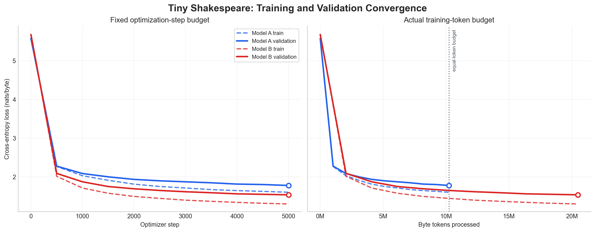
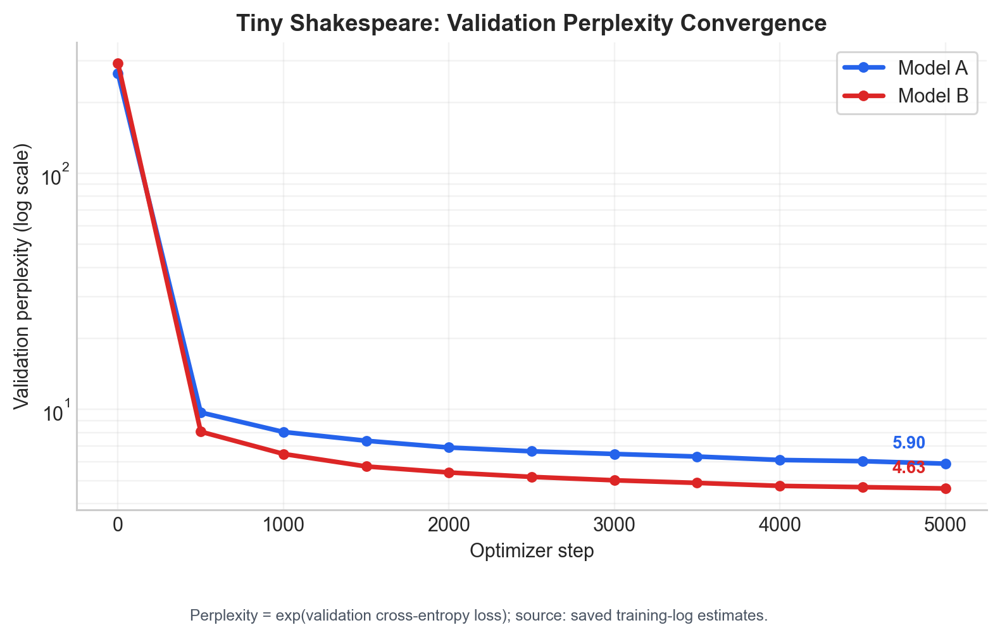

# Mini-LLM: Tiny Shakespeare





A reproducible byte-level GPT implementation in PyTorch, trained and evaluated on Tiny Shakespeare. The repository includes two model configurations, final checkpoints, loss logs, generated samples, evaluation metrics, and plotting code.

## Results

| Model | Layers | Heads | Embedding | Context | Training tokens | Validation loss | Perplexity | Bits/byte |
| --- | ---: | ---: | ---: | ---: | ---: | ---: | ---: | ---: |
| **Model A — Baseline** | 2 | 4 | 128 | 64 | 10.24M | 1.7431 | 5.7149 | 2.5147 |
| **Model B — Scaled** | 4 | 4 | 256 | 128 | 20.48M | 1.5059 | 4.5082 | 2.1726 |

The table reports deterministic full-validation evaluation of the final checkpoints. The convergence charts use validation estimates saved during training. Perplexity is calculated as `exp(validation loss)`, so final chart values may differ slightly from the full-validation table.

## Installation

Python 3.10 is recommended. Run all commands from the repository root.

```bash
python3.10 -m venv .venv
source .venv/bin/activate
python -m pip install --upgrade pip
python -m pip install -r requirements.txt
python -m pytest
```

PyTorch automatically selects CUDA or Apple MPS when available. Add `--device cpu` to any training or generation command to force CPU execution.

## Model A: train and generate

Train Model A with the documented configuration and seed:

```bash
python -m mini_llm.train \
  --config model_a \
  --grad-clip 1.0 \
  --seed 1337
```

Generate 150 new byte tokens from the final Model A checkpoint:

```bash
python -m mini_llm.generate \
  --checkpoint mini_llm/checkpoints/model_a.pt \
  --prompt "To be, or not to" \
  --max-new-tokens 150 \
  --temperature 1.0 \
  --seed 1337 \
  --output evaluation/generations/model_a_generation.json
```

## Model B: train and generate

Train Model B with the documented configuration and seed:

```bash
python -m mini_llm.train \
  --config model_b \
  --grad-clip 1.0 \
  --seed 1337
```

Generate 150 new byte tokens from the final Model B checkpoint:

```bash
python -m mini_llm.generate \
  --checkpoint mini_llm/checkpoints/model_b.pt \
  --prompt "To be, or not to" \
  --max-new-tokens 150 \
  --temperature 1.0 \
  --seed 1337 \
  --output evaluation/generations/model_b_generation.json
```

## Evaluation

### 1. Generate the DeepInfra reference samples

The cross-system generation analysis compares Model A and Model B with Gemini Flash 3.5 through DeepInfra. Create the local environment file and set your API key:
s
```bash
cp .env.example .env
```

Open `.env` and replace the placeholder value for `DEEPINFRA_API_KEY`, then generate the reference samples:

```bash
python -m evaluation.generate_gemini_deepinfra
```

This writes `evaluation/generations/gemini_flash.jsonl`, including the prompt, returned text, provider model, completion-token count, finish reason, and generation timestamp. A saved reference file is included in the repository, so this API step can be skipped when inspecting the existing results.

### 2. Run the local evaluation pipeline

After both local checkpoints and the DeepInfra reference file are available, run:

```bash
python -m evaluation.generate_samples --max-new-tokens 150 --seed 1337
python -m evaluation.evaluate --seed 1337
python -m evaluation.training_analysis
python -m evaluation.analyze_generations
python -m evaluation.plot_losses
```

These commands reproduce:

- Gemini Flash reference generations through DeepInfra.
- Fixed-prompt Model A and Model B generations.
- Full-validation loss, perplexity, and bits-per-byte metrics.
- Convergence and equal-token comparison tables.
- Loss, perplexity, and equal-token charts.
- Deterministic generation-quality measurements.

The largest shared training budget is 10.24M byte tokens. At this budget, the logged validation loss is 1.7750 for Model A and 1.6459 for Model B.

## Repository structure

```text
mini_llm/
├── configs.py              # Model presets
├── data.py                 # Byte tokenizer and dataset loader
├── model.py                # GPT architecture
├── train.py                # Training and checkpoint loop
├── generate.py             # Single-prompt generation
├── checkpoints/            # Final and best checkpoints
└── logs/                   # Training-loss CSV files

evaluation/
├── prompts.txt             # Fixed evaluation prompts
├── evaluate.py             # Full-validation metrics
├── generate_samples.py     # Paired local generation
├── analyze_generations.py  # Generation metrics
├── training_analysis.py    # Convergence analysis
├── plot_losses.py          # Loss and perplexity charts
├── generations/            # Saved generation outputs
├── results/                # Saved evaluation tables
└── plots/                  # Saved figures

data/tiny_shakespeare.txt   # Included corpus
tests/                      # Automated tests
requirements.txt            # Pinned dependencies
```

## Reproducibility

- Fixed 90/10 train-validation split.
- Fixed UTF-8 byte vocabulary of size 256.
- Default seed `1337` for Python, NumPy, PyTorch, and CUDA.
- AdamW optimization with cross-entropy loss and optional gradient clipping.
- Checkpoints include model configuration, optimizer state, tokenizer metadata, training step, and loss history.
- Direct dependencies are pinned in `requirements.txt`.
