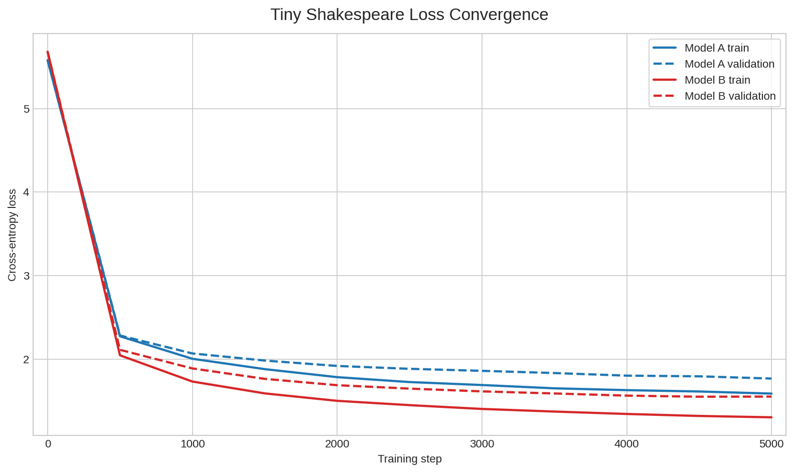

# Mini-LLM Tiny Shakespeare

This repository implements a small byte-level GPT-style Transformer trained on Tiny Shakespeare. Source code lives in the `mini_llm/` package, while generated checkpoints, logs, plots, metrics, and generations are kept under `outputs/`.

## Installation

```bash
conda create -n tiny_llm python=3.10
conda activate tiny_llm
python -m pip install -r requirements.txt
```

The dataset loader downloads Tiny Shakespeare automatically on first use and saves it as `tiny_shakespeare.txt` in the repository root.

## Train

Train Model A:

```bash
python -m mini_llm.train --config model_a
```

Train Model B:

```bash
python -m mini_llm.train --config model_b
```

Training writes:

```text
outputs/checkpoints/model_a.pt
outputs/checkpoints/model_b.pt
outputs/logs/model_a_loss.csv
outputs/logs/model_b_loss.csv
```

## Evaluate

Compute validation cross-entropy and perplexity:

```bash
python evaluation/evaluate.py
```

Metrics are saved to `outputs/evaluation/metrics.csv`. If checkpoints are missing, the script prints the training command that must be run first.

Create the loss convergence plot:

```bash
python evaluation/plot_losses.py
```

The plot is saved to `outputs/evaluation/plots/loss_convergence.png`. Both Model A and Model B loss logs must exist.

## Generate Samples

Generate exactly 150 new byte tokens per prompt for both local models:

```bash
python evaluation/generate_samples.py
```

Outputs are saved to:

```text
outputs/evaluation/generations/model_a.txt
outputs/evaluation/generations/model_b.txt
```

The Gemini Flash comparison file is kept at `outputs/evaluation/generations/gemini_flash.txt`. The qualitative table is saved to `outputs/evaluation/comparison_table.md`.

Generate Gemini Flash samples through DeepInfra and fill `gemini_flash.txt`:

```bash
DEEPINFRA_API_KEY=your_deepinfra_key python evaluation/generate_gemini_deepinfra.py
```

You can also put the key in a local `.env` file:

```text
DEEPINFRA_API_KEY=your_deepinfra_key
```

Then run:

```bash
python evaluation/generate_gemini_deepinfra.py
```

The script also refreshes `outputs/evaluation/comparison_table.md` after writing the Gemini generations.


Single-prompt checkpoint generation is also available:

```bash
python -m mini_llm.generate --checkpoint outputs/checkpoints/model_a.pt --prompt "To be, or not to " --max_new_tokens 150
```

## Model Presets

Model A is the smaller baseline: `block_size=64`, `batch_size=32`, `n_embd=128`, `n_head=4`, `n_layer=2`, `dropout=0.2`, and `learning_rate=3e-4`.

Model B is larger: `block_size=128`, `batch_size=32`, `n_embd=256`, `n_head=4`, `n_layer=4`, `dropout=0.2`, and `learning_rate=3e-4`.

Both models use a fixed byte-level tokenizer with `vocab_size=256`.

## Expected Layout

```text
.
|-- mini_llm/
|   |-- __init__.py
|   |-- configs.py
|   |-- data.py
|   |-- model.py
|   |-- train.py
|   |-- generate.py
|   `-- utils.py
|-- evaluation/
|   |-- prompts.txt
|   |-- evaluate.py
|   |-- generate_samples.py
|   `-- plot_losses.py
|-- outputs/
|   |-- checkpoints/
|   |   |-- model_a.pt
|   |   `-- model_b.pt
|   |-- logs/
|   |   |-- model_a_loss.csv
|   |   `-- model_b_loss.csv
|   `-- evaluation/
|       |-- metrics.csv
|       |-- generations/
|       |   |-- model_a.txt
|       |   |-- model_b.txt
|       |   `-- gemini_flash.txt
|       |-- plots/
|       |   `-- loss_convergence.png
|       `-- comparison_table.md
|-- docs/
|   |-- report.md
|   |-- architecture_mapping.md
|   `-- annotated_diagram.png
|-- requirements.txt
|-- README.md
`-- tiny_shakespeare.txt
```
